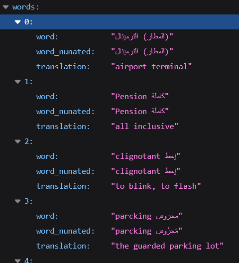

# API-Tunsian-Dialect-English-Words

An API for Tunisian Dialect to English Words

<p align="center">

</p>

# Routes details

The API have 4 different routes. All of which are <b>GET</b> methods:
* Getting the list of <b>all the words</b>
* Getting a single word by <b>id</b>
* Getting the Tunisian translation of a searched <b>English word</b>
* Getting the English translation of a searched <b>Tunisian word</b>

## Getting the list of all the words

the full list of all the words and their translation contains over 6,000 enteries.

the URI for getting the full list:

```
  /api/words/
```
  
## Getting a word by its ID

An ID is a unique value defining each entry.

the URI for getting a word by its ID:

```
  /api/words/:id
```


## Getting the Tunisian translation of a searched English word
Every English word has a Tunisian translation and a nunated version of the word.

the URI for getting a Tunisian translation of a searched English word:

```
  /api/words/en-tn/:english_word
```

## Getting the English translation of a searched Tunisian word
Every Tunisian word has a an English translation and a nunated version of the orginal word.

the URI for getting a Tunisian translation of a searched English word:

```
  /api/words/tn-en/:tunisian_word
```
  
  

# Usage
The project is using <b>NPM</b> to manage pckges. So, the package json files contain all the necessary npm packages used by the project.
Weather locally or on a remote server, the installation process is done by running the command:

```
  npm install
```
To run the <b>API</b>, the next command should be executed:
```
  npm start
```


